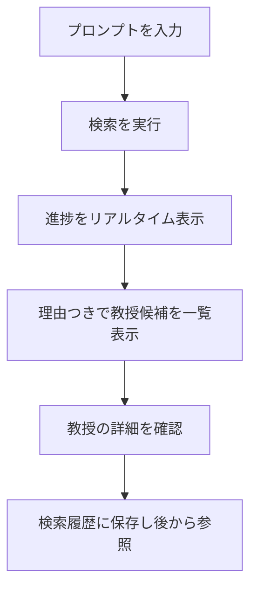

# 大学教授検索システム（Professor Search）

## 概要

自然文のプロンプト（例：「機械学習で医療画像を研究している先生を探したい」）から、意味の近い国際工科専門職大学の教授を検索し、なぜ合うのかの理由つきで推薦する Web アプリケーションです。キーワード一致ではなく、ベクトル類似検索と LLM による再ランキングを組み合わせることで、曖昧な言い回しでも適切な教授を提示します。

- **開発期間**：2026年4月〜2026年8月後半（約4か月半）
- **開発人数**：企画・設計・実装すべてを1人で担当

---

## 実際の画面


---

## 開発したもの

- **解決したい課題**：指導教員を探す大学生や、進学先を検討している高校生にとって、「どの分野の、どんな研究をしている教員がいるか」を大学サイトから探すのは難しい。専門用語での完全一致検索では、言葉が少し違うだけで目的の教員にたどり着けない。

- **開発したシステム**：やりたいこと・興味を自然文で入力すると、研究内容の意味的な近さで教授を検索し、「なぜ合うか」の説明つきで上位候補を提示するシステム。

- **利用データ**：本システムで検索対象とする教授データは、**Web 上に公開されている情報のみ**を使用しています。非公開の内部情報や個人情報は一切利用していません。

- **ユーザーができること**：
  - 興味・研究テーマを自然文で入力して教授を検索する
  - 各教授の一致理由・研究キーワード・教授の論文・プロフィールを確認する
  - 過去の検索履歴を保存し、一覧表示・詳細確認・削除を行う

**基本的な流れ**



---

## 主な機能

各機能を、ファイルの層（フロントエンド → プレゼンテーション → ユースケース → Port → Adapter → 横断）ごとに整理します。

### フロントエンド層（`frontend/src`：Next.js / React）

- **自然文入力 UI**：興味・研究テーマを自然文で入力して検索を開始する（`app/`, `components/`）。
- **リアルタイム進捗表示・キャンセル**：SSE で受信した進捗をパネルに反映し、実行中の検索をキャンセルできる（`lib/searchClient`, `state/`）。
- **結果・履歴の表示**：理由つき教授候補の一覧／詳細をメイン画面で表示し、検索履歴はサイドバーと詳細モーダルで確認・削除できる（`app/page.tsx`, `components/Sidebar.tsx`, `components/HistoryDetailModal.tsx`）。
- **キャラクターアニメーション**：検索中の状態を表現する GSAP 製スライムキャラを表示する（`lib/animation`, `public/slime`）。

### プレゼンテーション層（`app/modules/*/routes_*.py`：FastAPI ルート）

- **同期検索 API**：検索リクエストを受け付け、その場で検索結果を返す（`search/routes_search.py`）。
- **非同期ジョブ + SSE 進捗配信**：バックグラウンド検索の進捗を SSE で配信し、キャンセル・状態取得を受け付ける（`search/routes_search_jobs.py`）。
- **検索履歴 API**：履歴の保存・一覧・詳細・削除のエンドポイントを提供する（`history/routes_prompt_history.py`）。

### ユースケース／ドメイン層（各 Module のドメイン実装）

- **意味検索（RAG）オーケストレーション**：意図判定 → ベクトル検索 → 閾値判定 → LLM 再ランキングまでの検索フローを統括する（`search/search_engine.py`）。
- **低信頼時のクエリ拡張**：類似度が閾値に届かない場合、LLM でクエリを言い換えて再検索し、取りこぼしを減らす（`search/search_engine.py`）。
- **非同期ジョブ管理**：ジョブの生成・進捗更新・キャンセル・失効を管理する（`search/job_store.py`, `shared/progress.py`）。
- **検索履歴の保存**：入力・結果・埋め込みを永続化し、一覧／詳細／削除で利用できる状態にする（`history/prompt_history_service.py`, `history/repository.py`）。

### Port 層（`app/modules/*/ports.py`：契約）

- **技術非依存の契約定義**：AI（埋め込み・生成）／ベクトル検索／履歴永続化を Interface として定義し、ドメインが具体技術に依存しないようにする。
- **AI プロバイダ差し替えの抽象化**：埋め込み・生成 LLM を Port 越しに扱い、実装を他プロバイダへ差し替え可能にする（`ai/ports.py`）。

### Adapter 層（`app/modules/*/adapters`・各技術実装）

- **Gemini 実装**：埋め込み生成・LLM 生成・理由文生成を Gemini で実装する（`ai/adapters/gemini_*.py`）。
- **LLM 出力の検証パース**：LLM の JSON 出力をスキーマ検証つきでパースし、失敗時はリトライ・フォールバックする（`search/llm_parser.py`）。
- **ベクトル索引（ChromaDB）**：教授埋め込みの索引を構築・永続化・検索する（`document/vector_store.py`）。
- **教授データのロード**：Web 公開情報から整形した教授データを読み込む（`document/professor_loader.py`, `document/professor.py`）。
- **履歴永続化（SQLAlchemy）**：履歴・結果を DB に読み書きする（`history/repository.py`, `history/orm_*.py`）。

### 横断層（`app/shared`・合成点）

- **共通モデル・ユーティリティ**：リクエスト／レスポンス／LLM 応答モデル、進捗、類似度計算などを Module 横断で共有する（`shared/models`, `shared/progress.py`, `shared/similarity.py`）。
- **依存の合成（DI）**：Adapter を Port に注入する合成点で依存を組み立てる（`app/container.py`）。

---

## セットアップ方法

### 1. 必要な環境

- 言語：Python 3.11 以上 / Node.js 18 以上（必須）
- バックエンド：FastAPI（Uvicorn で起動）
- フロントエンド：Next.js 14 / React 18
- データベース：PostgreSQL（pgvector 拡張）
- 外部サービス：Google Generative AI（Gemini）API キー（必須）
- その他（任意）：Docker / Docker Compose（バックエンド開発用）

### 2. リポジトリの取得

```bash
git clone <repository-url>
cd <repository-name>
```

### 3. 依存関係のインストール

```bash
# バックエンド（Python）
python -m venv .venv
source .venv/bin/activate
pip install -r requirements.txt

# フロントエンド（Node.js）
npm install
npm install --prefix frontend
```

### 4. 環境変数の設定

プロジェクト直下に `.env` を作成し、必要な値を設定します（秘密情報はコミットしないこと）。

```env
# 必須
DATABASE_URL=postgresql+psycopg2://<user>:<password>@localhost:5432/<db>
GEMINI_API_KEY=            # 複数キーをローテーションする場合は GEMINI_API_KEYS=key1,key2

# 任意（既定値あり）
EMBEDDING_MODEL=models/text-embedding-004
GENERATION_MODEL=gemini-1.5-flash
ALLOWED_ORIGINS=http://localhost:3000
APP_ENV=development
```

フロントエンドの API 接続先を変える場合は `frontend/.env.local` に設定します（未設定なら `http://localhost:8000`）。

```env
NEXT_PUBLIC_API_URL=http://localhost:8000
```

### 5. 外部サービスの準備

- **PostgreSQL**：起動後、マイグレーションでスキーマを作成する。
  ```bash
  alembic upgrade head
  ```
- **教授データの配置**：検索の元データ `app/data/professors_with_abstracts_v2.1.json` を配置する（リポジトリには含まれないため別途用意）。
- **ベクトル索引**：`app/data/chroma_store/` が無ければ初回検索時に自動構築される（全教授分の埋め込みを計算するため初回のみ時間・API 消費あり。2 回目以降は永続化索引を再利用）。
- **Gemini API**：`.env` に有効なキーを設定しておく。

### 6. アプリケーションの起動

```bash
# バックエンドとフロントエンドを同時起動（プロジェクト直下）
npm run dev
```

```text
1. PostgreSQL を起動し、alembic upgrade head を実行
2. .env に DATABASE_URL / GEMINI_API_KEY を設定
3. npm run dev でバックエンド（:8000）とフロントエンド（:3000）を起動
4. ブラウザで動作確認
```

### 7. 動作確認

- バックエンド疎通：`GET http://localhost:8000/api/health` が `{"status":"ok"}` を返す。
- フロントエンド：`http://localhost:3000` にアクセスし、プロンプトを入力して検索を実行。進捗表示のあと、理由つきの教授候補が一覧表示されれば正常。

---

## 使用技術

| 分類        | 使用技術 |
| --------- | --------- |
| フロントエンド   | Next.js 14（App Router）, React 18, TypeScript, Tailwind CSS, GSAP |
| バックエンド    | Python, FastAPI, Pydantic, Uvicorn |
| AI / 機械学習 | Google Generative AI（Gemini：埋め込み・生成）, ベクトル類似検索（RAG）|
| データベース    | PostgreSQL + pgvector, ChromaDB（ベクトル索引）, SQLAlchemy, Alembic |
| インフラ / 通信 | HTTPS/REST（JSON）, SSE（Server-Sent Events）, Docker / Docker Compose |
| その他       | pytest（テスト）, import-linter（アーキテクチャ依存検査）, pdfminer.six |

---

## アーキテクチャ

```Mermaid
  flowchart TD
      A["ユーザー入力<br/>自然文プロンプト"]

      B["フロントエンド<br/>Next.js<br/>lib/api・searchClient"]

      C["検索開始<br/>HTTPS / JSON"]

      D["バックエンド<br/>FastAPI<br/>modules/search/routes_*"]

      E["job_id を即時返却"]

      F["検索ユースケース<br/>SearchEngine"]

      G["① 意図判定"]
      H["② ベクトル検索"]
      I{"③ 信頼度が<br/>閾値以上か？"}
      J["④ クエリ拡張"]
      K["⑤ LLM 再ランキング<br/>＋理由生成"]

      V[("ベクトル索引<br/>ChromaDB")]
      AI["AI<br/>Gemini<br/>埋め込み / 生成"]
      DB[("履歴永続化<br/>PostgreSQL")]

      L["SSE で進捗を送信"]
      M["SSE done<br/>理由つき教授候補を返却"]

      N["フロントエンド<br/>検索結果を描画"]

      A --> B
      B -->|"HTTPS / JSON"| C
      C --> D

      D --> E
      E -->|"job_id"| B

      D --> F
      F --> G
      G --> H

      H --> V
      H --> AI

      H --> I

      I -->|"Yes"| K
      I -->|"No"| J
      J --> AI
      AI --> K

      K --> DB

      F -.->|"処理中"| L
      L -.->|"SSE"| B

      K --> M
      M -->|"SSE done"| B

      B --> N
```

- 機能単位の **Modular Monolith**（`app/modules/{search, history, ai, document}`）＋横断契約（`app/shared`）＋合成点（`app/container.py`）で構成。
- 各 Module 内は **Hexagonal Architecture（Port / Adapter）** で、外部技術（Chroma・SQLAlchemy・Gemini）への依存を Port 越しに分離。

---

## 特にこだわった点

各項目は **課題 → 行動 → 結果** の順で説明します。

### ① 検索精度の改善：AI を「二段構え」にして、当たりを増やす

- **課題**：ただ「文の意味が近い教授」を上から並べるだけだと、惜しい候補を取りこぼしたり、ほんとうに合う人が上位に来なかったりする。とくに入力が短い・言葉がふわっとしている時に精度が落ちやすい。
- **行動**：検索を一発勝負にせず、次の3つを重ねた。
  1. **意味で候補を集める（ベクトル検索）**：入力文と教授の研究内容を「数字の並び（ベクトル）」に変換し、意味の近さで候補を集める。言い回しが違っても内容が近ければヒットする。
  2. **自信がない時は言い換えて再検索（クエリ拡張）**：集めた候補の近さが基準（閾値）に届かない＝「たぶん外している」時は、AI に入力を別の言葉へ言い換えさせ、もう一度探し直して取りこぼしを拾う。
  3. **最後に AI が並べ直して理由をつける（再ランキング）**：残った候補だけを AI が読み直し、本当に合う順に並べ替えたうえで「なぜ合うか」を日本語で説明する。全員ではなく候補だけを見せるので、速く・的確になる。
- **結果**：単純な意味検索より、あいまいな入力でも意図に近い教授が上位に出やすくなった。さらに「なぜこの人なのか」が言葉で示されるので、ユーザーが結果を納得して選べる。

### ② 安全性・バリデーション：おかしな入力・出力でも壊れないようにする

「バリデーション」＝入力や出力が正しい形か**事前にチェックする**こと。ここでは「変なデータが来ても落ちない・秘密が漏れない」ことにこだわった。

- **入力のチェック**：検索の文字が空・長すぎなどの場合は、`Pydantic`（形をチェックする道具）で弾き、`422`（＝入力が不正です、というエラー番号）を返す。おかしな入力のままAIに渡さない。
- **AI の出力のチェック**：AI の答え（JSON）は形が崩れることがあるので、想定した形か検証してから使う。失敗したらやり直し、それでもダメなら AI を使わない安全な方法（フォールバック）で結果を返す。存在しない教授が混じっていたら除外する。
- **エラーの中身を見せない**：内部のエラーやプログラムの詳細（スタックトレース）はユーザーに出さず、`{success, data, error}` という決まった形だけを返す。攻撃のヒントになる情報を漏らさないため。
- **他人の検索を触らせない（認可）**：検索ジョブは本人のセッション（HttpOnly Cookie）に紐づけ、別人が他人の進捗を見たり止めたりしようとすると `403`（＝権限なし）で拒否する。
- **壊れにくくする工夫**：進捗バーは戻らない（必ず増える）、キャンセルは何回押しても同じ結果、動きが止まったジョブは自動で片付ける。

### ③ 問題を切り分けやすくする設計：どこが壊れたか一目で分かる

- **課題**：機能があちこちのファイルに散らばっていると、不具合が起きた時に「どこを直せばいいのか」を探すだけで時間がかかる。
- **行動**：関係する処理を**機能ごとのまとまり（モジュール）** に分けた（`search`＝検索 / `history`＝履歴 / `ai`＝AI連携 / `document`＝教授データ）。さらに各モジュールの中を「**契約（ports）＝やることの決め事**」「**実装（adapters）＝実際の中身**」に分けている。そしてモジュール同士の参照方向を一方通行に固定し、`import-linter` という道具で「ルール違反の参照がないか」を自動チェックする。
- **結果**：不具合が起きても「まず該当モジュールを見ればいい」と当たりがつけやすい。参照の混線（相互に呼び合ってしまう状態）も自動検査で防げるので、機能を足しても構造が崩れにくい。

---

## 補足

- **利用データについて**：本プロジェクトが検索対象とする教授データは、**Web 上に公開されている情報のみ**を用いて構築しています。非公開データや機密情報は使用していません。
- 検索の元データ `app/data/` と `.env` はリポジトリに含まれないため、セットアップ時に別途用意すること。
